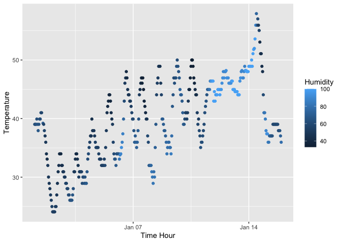

P8105_HW_sm5567
================
Shina Min
September 2023

- [Section 1](#section-1)
- [Section 2](#section-2)

# Section 1

- The variables in this dataset: 15 variables including origin, year,
  month, day, hour, temp, dewp, humid, wind_dir, wind_speed, wind_qust,
  precip, pressure, visib, and time_hour.

- This dataset has 358 entries.

- The dataset has 15 rows and 358 columns.

- The mean of temperature is 39.58212

``` r
library(ggplot2)
library(moderndive)
library(tidyverse)
```

    ## ── Attaching core tidyverse packages ──────────────────────── tidyverse 2.0.0 ──
    ## ✔ dplyr     1.1.3     ✔ readr     2.1.4
    ## ✔ forcats   1.0.0     ✔ stringr   1.5.0
    ## ✔ lubridate 1.9.2     ✔ tibble    3.2.1
    ## ✔ purrr     1.0.2     ✔ tidyr     1.3.0
    ## ── Conflicts ────────────────────────────────────────── tidyverse_conflicts() ──
    ## ✖ dplyr::filter() masks stats::filter()
    ## ✖ dplyr::lag()    masks stats::lag()
    ## ℹ Use the conflicted package (<http://conflicted.r-lib.org/>) to force all conflicts to become errors

``` r
data("early_january_weather")

n_rows <- nrow(early_january_weather)
n_cols <- ncol(early_january_weather)

mean_temp <- mean(early_january_weather$temp) 
mean(pull(early_january_weather,'temp'))
```

    ## [1] 39.58212

``` r
ggplot(early_january_weather, aes(x = time_hour, y = temp, color = humid)) + 
  geom_point() + labs(x = "Time Hour", y = "Temperature", color = "Humidity")
```

<!-- -->

``` r
ggsave("Shinaplot.pdf",plot = last_plot())
```

    ## Saving 7 x 5 in image

# Section 2

- Data frame comprised of:

``` r
samp = rnorm(10)
length(samp)
```

    ## [1] 10

``` r
s2_df = tibble(
  samp = rnorm(10, sd = 1),
  vec_logical = samp > 0,
  vec_char = c("a", "b", "c", "d", "e", "f", "g", "h", "i","j"),
  vec_factor = factor(c("red", "green", "blue","red", "green", "blue", "red","green","blue", "red"))
)
```
